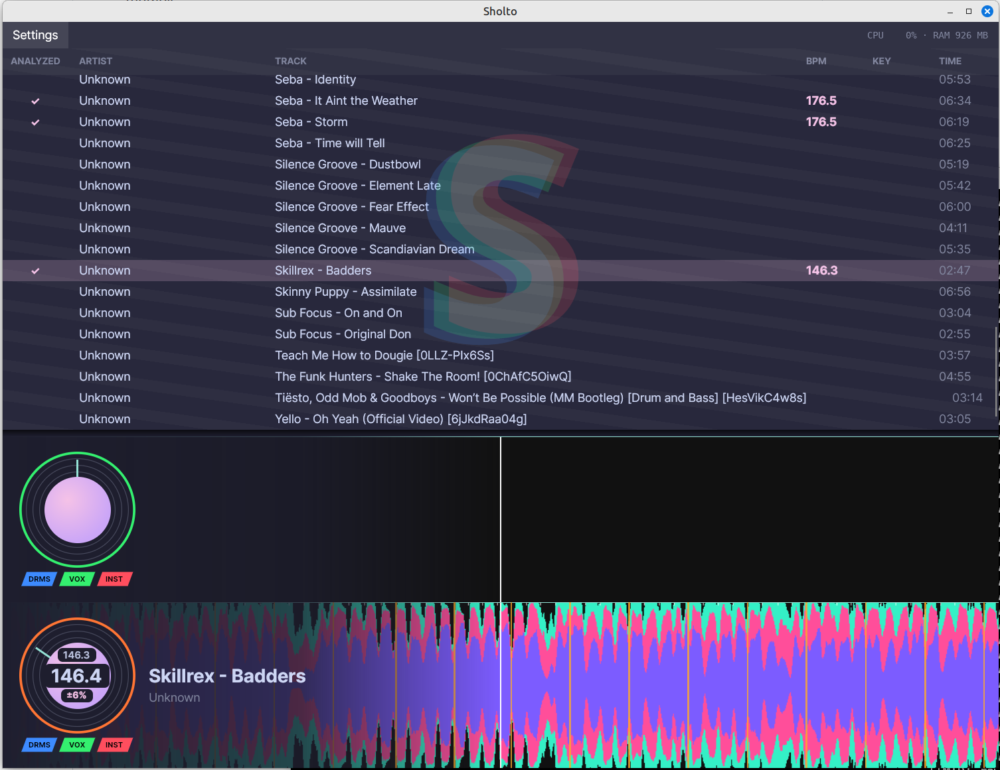

# Sholto

New DJ controller software — a free alternative to Rekordbox / Serato.

**Status:** currently developed and tested on **Linux** (Ubuntu / PipeWire) with the **Pioneer DDJ-FLX4** controller. Cross-platform support (Windows / macOS) and other controllers are next on the roadmap.



## Features

### Library
- Scans `~/Music` recursively (mp3, wav, flac, ogg, m4a, …) using ATL for tag metadata
- **Track table** with Artist · Track · BPM · Key · Time columns
- BPM column auto-uplifts as analyses come back from cache / madmom
- **SQLite-backed analysis cache** at `~/.local/share/sholto/library.db` — every track is analysed once and the result survives restarts
- 3-tier lookup pipeline: in-memory → SQLite → compute, with automatic write-through

### Audio analysis
- **Best-in-class beat tracking** via [madmom](https://github.com/CPJKU/madmom)'s RNN + dynamic-Bayesian-network detector (the `madmom-onnx` fork — ONNX runtime, no Theano)
- **Real downbeats** drawn as taller / coloured ticks (not "every 4th")
- **3-band frequency split** (low / mid / high) per waveform column via biquad filters with 5-tap smoothing
- **Stem separation** via [Demucs](https://github.com/facebookresearch/demucs) (htdemucs — Hybrid Transformer). One-time pass per track produces *vocals / drums / bass / other* WAVs, cached at `~/.local/share/sholto/stems/<hash>/` so re-loads are instant
- **Live analysis reporter** — track rows show an indeterminate progress bar while analysing and a themed ✓ once basic + stems are both done

### Playback
- **Two decks** with independent playback, scrubbing, and analysis
- **SoundFlow + miniaudio** under the hood — routes through PulseAudio / PipeWire on Linux
- **Per-track audio cache**: load into either deck instantly the second time
- Audio output device selectable at runtime from the Settings menu; chosen sink persists
- **Sub-pixel-accurate playhead** read straight from the data provider (no drift between 44.1 kHz source and 48 kHz engine)
- **Stem-mix playback** — once stems are ready, the deck transparently switches to a four-SoundPlayer mix (drums / vocals / bass / other) all sample-locked to the engine clock. Per-stem volume becomes live-mutable
- **3-band Linkwitz–Riley isolator EQ** per deck (24 dB/oct crossovers at 250 Hz / 4 kHz). Full-cut all three bands → true silence, like a DJM hardware isolator. Lock-free `BiquadEq3Band` SoundModifier, atomic gain updates from MIDI
- **Magnetic beat-snap** — when both decks are playing and their nearest downbeats approach alignment, jog ticks get scaled down by a smoothstep curve and a green glow lights both decks; once you let go, the adjusted deck quantises onto the reference deck's grid

### Visuals
- **GPU-baked waveform** rendered once at load to a Skia surface; per-frame cost is one textured blit (no per-pixel re-paint)
- **Rekordbox-style 3-colour bands** that stack low → mid → high outward from the centre line
- **Beat-grid markers** along the top edge — downbeats highlighted
- **Spinning vinyl disc** that rotates one revolution per bar at the track's BPM, with a mint-coloured needle peeking out from behind the album-art label
- **Outer ring colour** transitions green → yellow → orange → red across the track length; **flashes** when within the last 10 %
- **Effective-gain line** — a thin mint horizontal line across each waveform showing the combined channel × crossfader volume
- Big track title + artist next to each deck's disc
- BPM rendered both prominently in the deck readout and softly inside the spinning disc label
- **Stem activity chips** under each disc — coloured parallelogram tags
  (DRMS / VOX / INST), filled when audible, hollow when muted
- **Red mute tint** over the whole deck whenever its effective gain is 0
  (channel fader down or crossfader fully on the other deck)
- **Seven themes** selectable from Settings → Theme:
  - **Tokyo Night** (default — navy + neon magenta/cyan)
  - **Classic** (cyan / amber, Rekordbox-style)
  - **Serato** (red / green / blue)
  - **Smoke** (moody warm charcoal + whiskey amber)
  - **Catppuccin Mocha** (soft pastel mauve/peach)
  - **Glacier** (calm Nordic slate-blue)
  - **Bloodmoon** (carbon + crimson + bone — high drama)

### Controls
Gestures that live across mouse, keyboard, and controller:
- **Click the BPM chip** on a deck to halve / double the analyser's reading. The chip jumps + flips card-style and lands on the corrected number — fixes the common madmom "doubled it" mistake (e.g. a 87 BPM downtempo coming back as 174). Click again to flip back. Persisted to SQLite per track.
- **Hold the controller song-select** (browse encoder press) for ~1 s on a highlighted track to force a fresh re-analysis. Bypasses every cache tier and overwrites the stored BPM / beats — rescue path for tracks whose cached analysis is wrong.
- **Magnetic beat-snap between decks** — when both decks are playing and their nearest downbeats drift toward alignment, jog ticks get scaled down by a smoothstep curve and both waveforms light up with a green stripe at the matching beat. Let go and the adjusted deck quantises onto the reference deck's grid. Same feel as Rekordbox / Serato beat-lock without needing to explicitly arm anything.

### Controller (Pioneer DDJ-FLX4)
- **Play / pause** on each deck
- **Jog wheels** — top platter (fast scrub) and side ring (fine seek), with different scrub-rate scaling per surface
- **Channel volume faders** per deck (14-bit MSB CC, channels 1 / 2)
- **Crossfader** with equal-power gain curve (14-bit MSB CC, channel 7)
- **Top scroll wheel** — rotate to step through the track list (signed delta encoder)
- **LOAD 1 / LOAD 2** buttons load the highlighted track into the corresponding deck
- **HI / MID / LOW EQ pots** drive the per-deck isolator (14-bit MSB CC `0x07` / `0x0B` / `0x0F` on channels 1 / 2)
- **Hot-cue pads 1 / 2 / 3** temporarily repurposed as **stem mute toggles** — drums / vocals / instrumental on each deck (once Demucs analysis has landed)
- Works on Linux via either RtMidi or a built-in `/dev/snd/midi*` raw-MIDI fallback (handles cases where RtMidi can't see the device under PipeWire)
- **Pluggable mappings** — drop a new `IControllerMapping` into `src/Sholto.Controller/Mappings/`, register it in `MappingRegistry.All`, and any controller can be supported the same way

### Keyboard
- **Space** play/pause Deck 1; hold **Shift** for Deck 2
- **← / →** seek ±10 s on Deck 1; hold **Shift** for Deck 2
- Arrow keys intercepted at the window level so the track-list ListBox doesn't eat them

## Architecture

```
Sholto.Library     Track, TrackScanner                       — domain primitives
Sholto.Analysis    WaveformPeaks, BasicAnalysis, beat        — pure analysis math, no deps
                   trackers, AnalysisProvider, MemoryCache
Sholto.Storage     SholtoDatabase, AnalysisCodec,            — persistence boundary (SQLite)
                   DatabaseAnalysisCache
Sholto.Audio       AudioEngine, DeckPlayer, AudioFileDecoder — playback I/O via SoundFlow / miniaudio
Sholto.Controller  MIDI input + Mappings/                    — pluggable per-device mappings
Sholto.App         Avalonia UI                               — everything visible
```

Built on **.NET 10**, **Avalonia 11**, **SoundFlow** (miniaudio under the hood, talks to PulseAudio / PipeWire on Linux). Audio decoding via NAudio + NLayer.

## Install + run

```bash
git clone https://github.com/sebastianpatten/Sholto.git
cd Sholto
bash install.sh                                  # one-shot install — .NET 10, ffmpeg, madmom-onnx, demucs, libpulse symlink
dotnet run --project src/Sholto.App
```

`install.sh` is idempotent — safe to re-run. It uses `sudo apt` for system packages and `uv` for madmom, both standard tools on modern Ubuntu / Mint / Pop! / Debian.

For iterative development, use `dotnet watch` so changes auto-rebuild:

```bash
dotnet watch --project src/Sholto.App run --no-hot-reload
```

The library scans `~/Music` on startup. Click a track in the list to load it into Deck 1; press LOAD 2 on a DDJ-FLX4 to load into Deck 2.

## License

Dual-licensed — see [LICENSE](LICENSE):

- **Individuals & noncommercial users**: free under the
  [PolyForm Noncommercial 1.0.0](https://polyformproject.org/licenses/noncommercial/1.0.0).
  Fork it, modify it, gig with it, contribute back — all fine.
- **Commercial use** (products, hosted services, large-company internal
  deployment): requires a paid commercial license. Open an
  [issue](https://github.com/sebastianpatten/Sholto/issues) to arrange.

Small businesses under $1M annual revenue can deploy Sholto internally
under the PolyForm terms. The goal is to keep Sholto free for individuals
and small shops while asking large companies to contribute back.
