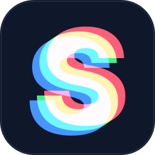
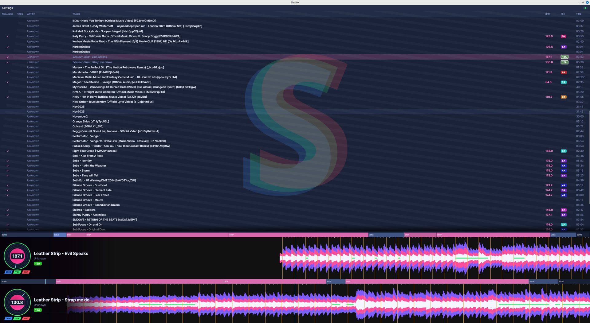

# Sholto

DJ software for mixing your own music — a free alternative to Rekordbox and Serato.

**Status:** runs on **Linux** with the **Pioneer DDJ-FLX4** controller today. Windows, macOS, and more controllers are on the way.



## What it does

### Your library
- Finds every track in your music folder — mp3, wav, flac, ogg, m4a, and more — and reads the artist, title, and other tags automatically.
- Shows everything in a sortable list: **Artist · Track · BPM · Key · Time**.
- Analyses each track once and remembers the result, so it's instant every time after.

### Reading your tracks
- **Automatic beat and tempo detection** — Sholto finds the BPM and marks the downbeats so your beatgrid lines up.
- **Key detection** — every track gets its musical key (with the Camelot code) so you can mix in harmony.
- **Stem separation** — splits a track into its parts (vocals, drums, bass, and the rest) so you can drop out the vocal or bring back the beat, live.
- A small progress bar shows a track being analysed, and a check mark when it's ready.

### Playing and mixing
- **Two decks** you can play, scrub, and mix independently.
- **3-band EQ** on each deck (highs, mids, lows) — cut a band all the way to silence, like a hardware isolator.
- **Filter knob** per deck — sweep from a low-pass to a high-pass for that classic build-up-and-drop feel.
- **Headphone cue** — pre-listen a track in your headphones while the crowd still hears the other deck.
- **Beat loops** — set a loop on the beat and halve or double its length on the fly.
- **Magnetic beat-snap** — when both decks are playing and the beats drift close together, the jog wheel gently "holds" on the beat and both waveforms glow green; let go and the deck locks to the other one's grid. No button to arm — it just happens.
- Pick which speakers or headphones Sholto plays to, and it remembers your choice.

### Seeing your tracks
- **Waveforms coloured by frequency** — deep bass, mids, and highs each get their own colour, and the height shows how intense each moment is, so you can spot the intro, the build-up, the drop, and the breakdown at a glance.
- **Beat-grid markers** along the top, with the downbeats highlighted.
- **A spinning vinyl disc** per deck that turns in time with the track, its ring shading from green to red as the track plays out and flashing near the end.
- **Stem chips** under each disc (drums / vocals / instrumental) — lit when you can hear that part, hollow when it's muted.
- The deck dims red when its volume is all the way down.
- **A range of colour themes** to switch between in Settings.

### Handy moves
- **Tap the BPM** on a deck to halve or double it — fixes the common case where a slow track gets read as twice its real speed. Tap again to flip back; it's remembered per track.
- **Hold the browse knob** on a highlighted track for about a second to re-analyse it from scratch — a rescue for the odd track whose beats came out wrong.

## Your DDJ-FLX4
- **Play / pause** and **jog wheels** (top platter to scrub fast, the side ring for fine nudges) on each deck.
- **Channel faders** and the **crossfader** for volume and blending.
- **EQ knobs** (high / mid / low) driving each deck's isolator.
- **The browse knob** scrolls the track list; **LOAD 1 / LOAD 2** load the highlighted track onto a deck.
- **Hot-cue pads** double as **stem mute toggles** — drums, vocals, instrumental — once a track's stems are ready.
- **The CUE buttons** send each deck to your headphones for pre-listening.

Adding support for another controller is straightforward — Sholto keeps each device's button layout in one place.

### Keyboard
- **Space** plays/pauses Deck 1; hold **Shift** for Deck 2.
- **← / →** jump ±10 seconds on Deck 1; hold **Shift** for Deck 2.

## Install and run

```bash
git clone https://github.com/freedomfirst26/Sholto.git
cd Sholto
bash install.sh
dotnet run -c Release --project src/Sholto.App
```

`install.sh` sets up everything Sholto needs and is safe to re-run. It works on modern Ubuntu, Mint, Pop!_OS, and Debian.

On startup Sholto scans your music folder. Click a track to load it onto Deck 1, or press LOAD 2 on the controller to load it onto Deck 2.

## License

Dual-licensed — see [LICENSE](LICENSE):

- **Individuals and noncommercial users**: free under the
  [PolyForm Noncommercial 1.0.0](https://polyformproject.org/licenses/noncommercial/1.0.0).
  Fork it, modify it, gig with it, contribute back — all welcome.
- **Commercial use** (products, hosted services, large-company internal
  deployment): needs a paid commercial license. Open an
  [issue](https://github.com/freedomfirst26/Sholto/issues) to arrange one.

Small businesses under $1M a year can use Sholto internally under the free terms. The goal is to keep Sholto free for individuals and small shops while asking large companies to chip in.
