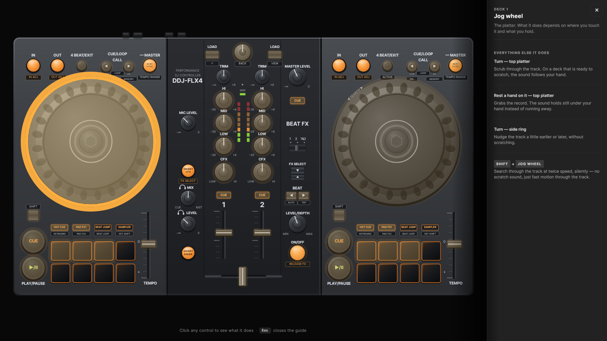

# Sholto

DJ software for mixing your own music — a free alternative to Rekordbox and Serato.

**Status:** runs on **Linux** with the **Pioneer DDJ-FLX4** controller today. Windows, macOS, and more controllers are on the way.




*Your controller, drawn on screen. Click anything to learn what it does — or press it on
the real thing and watch it light up here, without touching your decks. Controls Sholto
doesn't use are left uncoloured, so you can see at a glance what's live.*

Full guide: [docs/README.md](docs/README.md) — every button on screen and on the controller.

## What it does

### Your library
- Finds every track in your music folder — **mp3, FLAC, WAV, AIFF, and M4A/AAC** — and reads the artist, title, and other tags automatically.
- Shows everything in a sortable list: **Artist · Track · BPM · Key · Time**.
- Analyses each track once and remembers the result, so it's instant every time after.

### Finding and organising
- **Search** — press the spacebar and type. Sholto searches your **tracks, crates, and tags** all at once and shows the top few matches of each, so you can see everything you can jump to.
- **Tags** — label any track with words that matter to you ("peak time", "vocal", "drum & bass"), then filter the whole library down to a tag in one click.
- **Crates** — group tracks into crates (like playlists or record boxes) and jump to a crate's contents instantly. An **All Tracks** crate always holds everything; press **Esc** to get back to it.

### Reading your tracks
- **Automatic beat and tempo detection** — Sholto finds the BPM and marks the downbeats so your beatgrid lines up.
- **Key detection** — every track gets its musical key (with the Camelot code) so you can mix in harmony.
- **Stem separation** — splits a track into its parts (vocals, drums, bass, and the rest) so you can drop out the vocal or bring back the beat, live.
- A small progress bar shows a track being analysed, and a check mark when it's ready.

### Playing and mixing
- **Two decks** you can play, scrub, and mix independently.
- **3-band EQ** on each deck (highs, mids, lows) — cut a band all the way to silence, like a hardware isolator.
- **Filter knob** per deck — sweep from a low-pass to a high-pass for that classic build-up-and-drop feel.
- **Headphone cue** — pre-listen a track in your headphones while the crowd still hears the other deck.
- **Beat loops** — set a loop on the beat and halve or double its length on the fly.
- **Magnetic beat-snap** — when both decks are playing and the beats drift close together, the jog wheel gently "holds" on the beat and both waveforms glow green; let go and the deck locks to the other one's grid. No button to arm — it just happens.
- Pick which speakers or headphones Sholto plays to, and it remembers your choice.

### Seeing your tracks
- **Waveforms coloured by frequency** — deep bass, mids, and highs each get their own colour, and the height shows how intense each moment is, so you can spot the intro, the build-up, the drop, and the breakdown at a glance.
- **Beat-grid markers** along the top, with the downbeats highlighted.
- **A spinning vinyl disc** per deck that turns in time with the track, its ring shading from green to red as the track plays out and flashing near the end.
- **Stem chips** under each disc (drums / vocals / instrumental) — lit when you can hear that part, hollow when it's muted.
- The deck dims red when its volume is all the way down.
- **A range of colour themes** to switch between in Settings.

## Your DDJ-FLX4
Plug it in and it works. Click the controller icon in the top bar for a picture of your
DDJ-FLX4 with every knob, pad and button explained, including the Shift combinations.

Adding support for another controller is straightforward — Sholto keeps each device's button layout in one place.

### Keyboard
- **Space** — open search (type to find tracks, crates, and tags).
- **↑ / ↓** — move up and down the track list.
- **1 / 2** — load the highlighted track onto Deck 1 or Deck 2.
- **Enter** — open the actions menu for the highlighted track (add it to a crate, or tag it).
- **P** — play / pause Deck 1; hold **Shift** for Deck 2.
- **G** — open the beatgrid / tempo tuner on the playing deck; then **↑ / ↓** change the tempo and **← / →** nudge the grid.
- **M** — drop a marker on the playing deck.
- **Esc** — close a menu, or clear a tag/crate filter to go back to **All Tracks**.
- **F11** — toggle fullscreen.

## Install and run

Two ways to get Sholto — grab a ready-made binary, or build it yourself.

### Option 1 — one command (easiest)

```bash
curl -fsSL https://raw.githubusercontent.com/freedomfirst26/Sholto/main/get-sholto.sh | bash
```

That downloads the latest release into `~/sholto`, installs the runtime tools it needs (ffmpeg, madmom, and a couple of system libraries — it will ask for your password once), and launches Sholto. Run the same command again later to update. Set `SHOLTO_DIR=/somewhere` to install elsewhere, or add `--no-run` to install without launching:

```bash
curl -fsSL https://raw.githubusercontent.com/freedomfirst26/Sholto/main/get-sholto.sh | bash -s -- --no-run
```

Prefer to see what you're running first? Download the script, read it, then `bash get-sholto.sh`.

The binary is **self-contained — you don't need .NET installed.** If you'd rather do it by hand, grab `sholto-*-linux-x64.tar.gz` from the [**Releases**](https://github.com/freedomfirst26/Sholto/releases) page, `tar -xzf` it, run `bash install-deps.sh` once, then `./Sholto.App`.

### Option 2 — build from source

```bash
git clone https://github.com/freedomfirst26/Sholto.git
cd Sholto
bash install.sh
dotnet run -c Release --project src/Sholto.App
```

`install.sh` sets up everything Sholto needs — including .NET and all the tools below — and is safe to re-run. It works on modern Ubuntu, Mint, Pop!_OS, and Debian.

On startup Sholto scans your music folder. Click a track to load it onto Deck 1, or press LOAD 2 on the controller to load it onto Deck 2.

### What it needs

`install.sh` installs all of this for you on Ubuntu / Mint / Pop!_OS / Debian. On another distro, install the equivalents:

**Required**
- **.NET 10** — to build and run Sholto.
- **ffmpeg** — decodes your audio for the beat detector, and also decodes M4A/AAC files for playback.
- **madmom** (the `madmom-onnx` build) — finds the beats and tempo. Sholto can't play a track until it has a beatgrid, so this one isn't optional.
- A normal **Linux desktop** (X11 or Wayland) and a working **sound system** (PipeWire, PulseAudio, or ALSA).

**Optional** — Sholto runs fine without these, you just lose that one feature:
- **demucs** — stem separation (drums / vocals / bass / other). Without it, the stem chips and the hot-cue stem mutes are unavailable.
- **allin1** — AI song-section detection (intro / build / drop / …). Without it, Sholto falls back to a simpler built-in guess.

**Your controller** — a **Pioneer DDJ-FLX4** is picked up automatically when you plug it in; a green dot in the top bar means it's connected (red means reconnect the USB), and it reconnects on its own if it drops. You don't need one — everything works from the mouse and keyboard.

## License

Sholto is under the [Business Source License 1.1](LICENSE) — source-available,
and free for the people it is built for.

- **Individuals — free, including paid gigs.** If you are a person (or a sole
  trader / single-member company you run yourself), you can use, modify, fork,
  and perform with Sholto for any purpose, at no cost. Forks you publish must
  keep the copyright notice and credit Sholto in their README.
- **Organizations — paid.** Any use by or on behalf of a company or other
  organization, and any bundling of Sholto into a product or hosted service,
  needs a commercial licence — any size. Email <freedomfirst26@proton.me>.
- **It becomes Apache-2.0 on 2030-09-07.** Each released version converts to the
  Apache License 2.0 on its Change Date, so nothing is locked away forever.

> **Buying a commercial licence?** Read the non-commercial dependency warning in
> [THIRD-PARTY-NOTICES.md](THIRD-PARTY-NOTICES.md) first — madmom's beat-detection
> models are CC BY-NC-SA and need separate permission. Get in touch and we will
> sort it out.

"Sholto" and its logo are trademarks of the copyright holder and are not covered
by the licence. Forks are welcome under a different name.

Contributions are welcome under the DCO — see [CONTRIBUTING.md](CONTRIBUTING.md).
