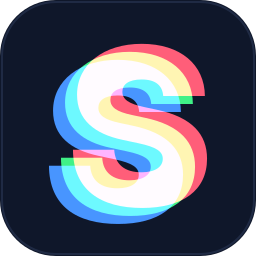
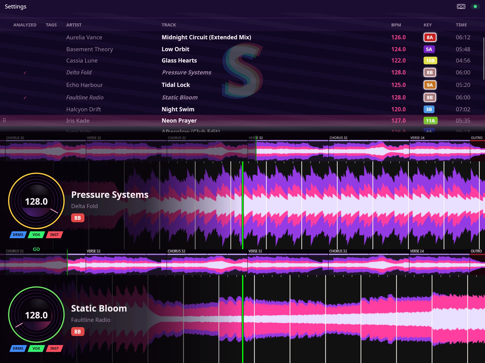
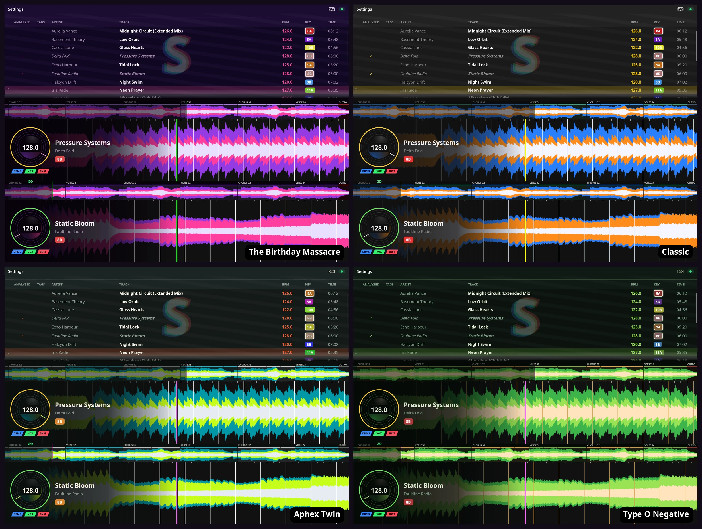
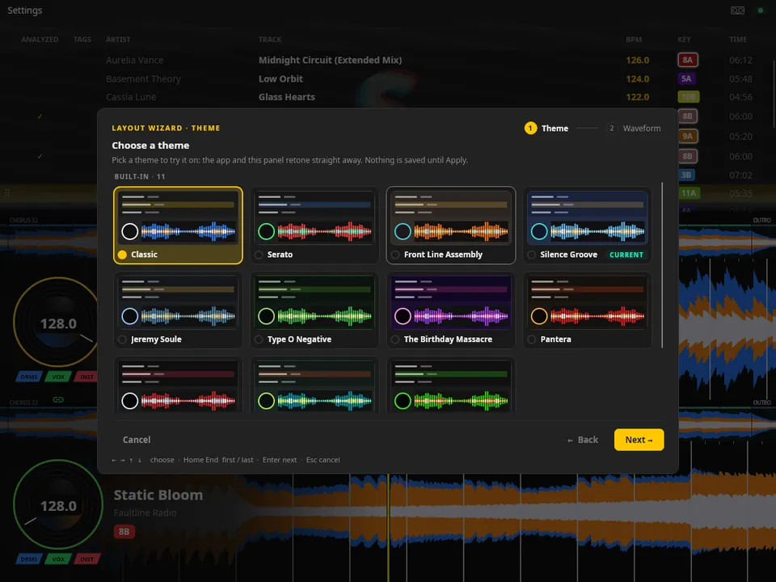
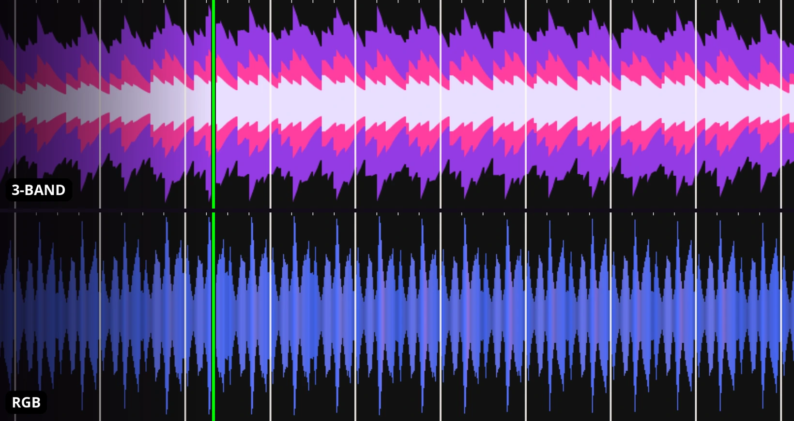
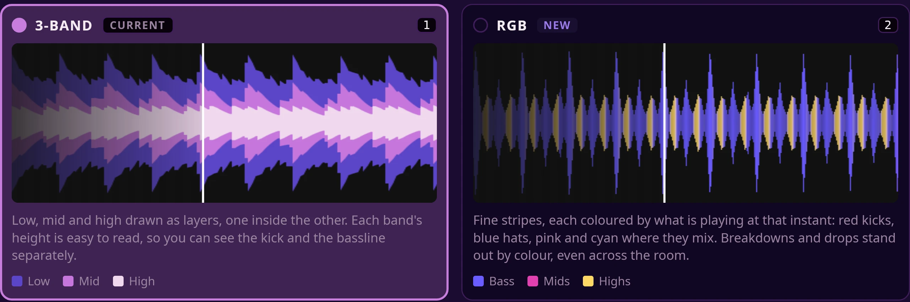
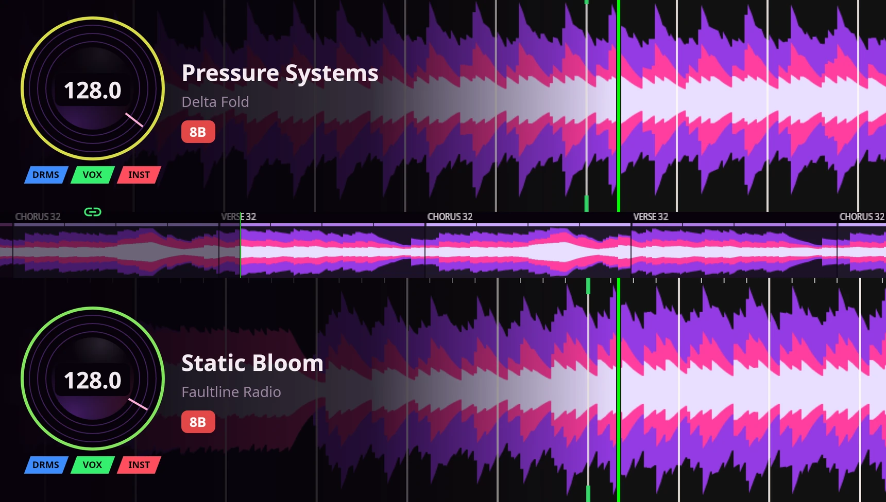
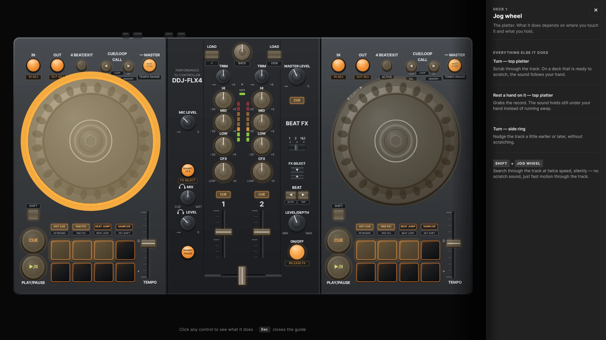

# Sholto

DJ software for mixing your own music — a free alternative to Rekordbox and Serato.

[](https://github.com/freedomfirst26/Sholto/releases/latest)



## Install

**You need:** 64-bit Linux — Ubuntu, Mint, Pop!_OS or Debian. A Pioneer DDJ-FLX4 is
optional; everything works from the mouse and keyboard.

**One command** — downloads the latest release into `~/sholto`, installs the tools it
needs (asks for your password once) and starts Sholto. Run it again to update.

```bash
curl -fsSL https://raw.githubusercontent.com/freedomfirst26/Sholto/main/get-sholto.sh | bash
```

**Or by hand** — download `sholto-vX.Y.Z-linux-x64.tar.gz` from the
[latest release](https://github.com/freedomfirst26/Sholto/releases/latest), then:

```bash
mkdir -p ~/sholto
tar -xzf ~/Downloads/sholto-*-linux-x64.tar.gz -C ~/sholto
cd ~/sholto
bash install-deps.sh
./Sholto
```

No .NET needed — the download is self-contained.

**Or build from source:**

```bash
git clone https://github.com/freedomfirst26/Sholto.git
cd Sholto
bash install.sh
dotnet run -c Release --project src/Sholto.Interface.MainUI
```

More options, what gets installed, and how to check it all works: [docs/install.md](docs/install.md).

## Make it yours



Eleven themes recolour everything — library, key chips, section map and waveforms. Or [write your own](docs/themes.md).



Try every theme on the whole app before you keep it: **Settings ▸ Layout Wizard…**

## Two waveform styles



**3-BAND** stacks bass, mids and highs as layers. **RGB** colours each fine stripe by what is playing at that instant. [More](docs/waveforms.md).



Both previews play the same demo track in your theme, so you pick by eye.

## Beats that snap together



Bring two tracks close and the jog wheel holds on the beat; let go and they lock. Nothing to arm. [How it works](docs/deck.md#magnetic-beat-snap).

## Your controller, drawn on screen



Plug in a **Pioneer DDJ-FLX4** and it just works. Click any control, or press it on the real thing, to see what it does.

## And the rest

Beat, tempo and key detection · stem separation (drop the vocal, keep the drums) ·
[search](docs/search.md) by name, initials, BPM, key, tag or crate · loops, EQ, filter, headphone cue · mp3, FLAC,
WAV, AIFF and M4A. **[Everything Sholto does →](docs/features.md)**

Runs on **Linux** with the **DDJ-FLX4** today. Windows, macOS, and more controllers are on the way.

## Documentation

[The guide](docs/README.md) — every part of the screen and every key ·
[Features](docs/features.md) · [Install](docs/install.md) · [Themes](docs/themes.md) ·
[Waveforms](docs/waveforms.md) · [Decks](docs/deck.md) · [Library](docs/library.md) ·
[What's new](CHANGELOG.md)

## Licence

From v1.1.0 Sholto is under the [PolyForm Shield License 1.0.0](LICENSE): source-available,
and **free for everyone**, including paid gigs, streaming, teaching, and clubs or bars
running it for their DJs. Anything that competes with Sholto (selling copies,
rebranding, hosting it, or bundling it with hardware or another product) needs a
commercial licence: <freedomfirst26@proton.me>. Earlier releases keep the licence they
shipped with (v0.1.0 and v0.2.0: PolyForm Noncommercial 1.0.0 with a free grant for
individuals; v0.3.0 and v1.0.0: Business Source License 1.1). In plain words:
[docs/license.md](docs/license.md). Third-party components and their licences,
including madmom's non-commercial (CC BY-NC-SA) beat-detection models, which are
licensed separately by their authors and which Sholto's licence does not cover, paid gigs
included: [THIRD-PARTY-NOTICES.md](THIRD-PARTY-NOTICES.md).

---

For developers: [code layout, building and contributing](docs/developers.md).
