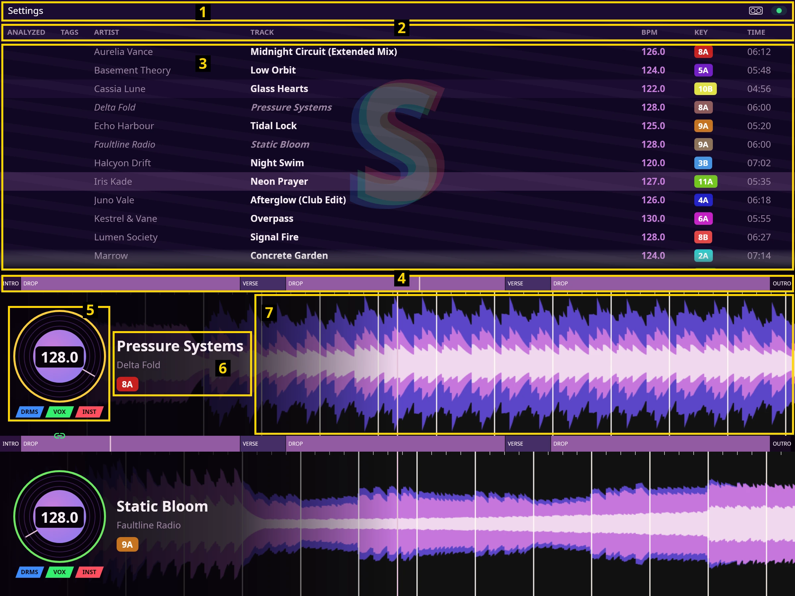

# Sholto — the guide

Every part of the screen, what you click, and what you press on the DDJ-FLX4.

**Other pages:** [Install](install.md) · [Features](features.md) · [Decks](deck.md) ·
[Library](library.md) · [Search](search.md) · [Themes](themes.md) · [Waveforms](waveforms.md) ·
[Licence](license.md) · [For developers](developers.md)

## What's on screen

1. **Top bar** — the **Settings** menu, the controller guide icon, and the controller dot. → [below](#top-bar)
2. **Library column headers** — ANALYZED · TAGS · ARTIST · TRACK · BPM · KEY · TIME. → [library.md](library.md#the-columns)
3. **Track list** — every track in your music folder, one row each. → [library.md](library.md)
4. **Section map** — the whole song as coloured blocks: intro, build, drop, breakdown. → [deck.md](deck.md#section-map)
5. **Disc, BPM and stem chips** — the spinning platter, its progress ring, the BPM, and DRMS / VOX / INST. → [deck.md](deck.md#stems)
6. **Track title and key chip** — what's loaded, and its Camelot key. → [deck.md](deck.md#key-chip-and-camelot)
7. **Waveform** — the scrolling track: frequency bands, beatgrid, vocals, loops, markers. → [deck.md](deck.md#waveform)

There are two decks. Deck 1 is the upper pair (4–7), Deck 2 the lower one.

## Top bar

- **Settings → Theme** — pick a colour theme; each entry shows its own colour swatches. See [themes.md](themes.md).
- **Settings → Layout Wizard…** — try every theme on the whole app, then choose the waveform style (3-BAND or RGB). See [themes.md](themes.md) and [waveforms.md](waveforms.md).
- **Settings → Music folder…** — choose the folder Sholto scans for music.
- **Settings → Output device…** — choose which sound card or headphones Sholto plays to. Your choice is remembered.
- **Controller icon** — opens the controller guide, a picture of your DDJ-FLX4 with every knob, pad and button explained. See [below](#your-controller).
- **Controller dot** (far right) — green means your DDJ-FLX4 is connected. It turns red and reads **Reconnect USB** when the controller drops off; Sholto keeps trying to reconnect on its own, so if it stays red, unplug and replug the USB cable.

## Your controller

Every knob, pad and button on the DDJ-FLX4 — including the Shift combinations — is
documented in the controller guide: click the controller icon in the top bar for a
picture of your controller with each control explained. With it plugged in, press
anything and the guide lights up the matching control and tells you what it does.

Transport is controller-only: nothing on screen starts, stops, or jumps the music.

## Keyboard at a glance

| Key | What it does |
|---|---|
| **Space** | Open search — tracks ranked by fit against the deck you're not loading into. What you can type: [search.md](search.md) |
| **Shift + 1** / **Shift + 2** (search open) | Load the highlighted track straight onto Deck 1 / Deck 2 |
| **← / →** (search open) | Choose which deck **Enter** loads onto |
| **Tab** (search open) | Switch between the track list and the side list (crates, tags) |
| **Ctrl + L** (search open) | Add the highlighted song, crate or tag to the Track List; search stays open |
| **Ctrl + Z** | Undo the last load within 10 s: the previous track returns, paused where you left it |
| **↑ / ↓** | Move up and down the track list |
| **1** / **2** | Load the highlighted track onto Deck 1 / Deck 2 |
| **Enter** | Open the actions menu for the highlighted track |
| **P** / **Shift + P** | Play or pause Deck 1 / Deck 2 |
| **M** / **Shift + M** | Drop a marker on Deck 1 / Deck 2 at the current spot |
| **G** | Open the tempo and beatgrid tuner on the deck you're working on |
| **↑ / ↓** (tuner open) | BPM ±0.1 — hold **Shift** for ±1 |
| **← / →** (tuner open) | Slide the grid ±10 ms — hold **Shift** for ±1 beat |
| **Esc** | Close the tuner |
| **F11** | Toggle fullscreen |

## Themes

Sholto ships with eleven colour themes, picked from **Settings → Theme** or tried on
in the **Layout Wizard**. A theme
recolours the whole app — the library, the section map, and the waveform's bands,
grid, playhead, markers and loop. You can write your own and drop it in a folder;
see [themes.md](themes.md).
