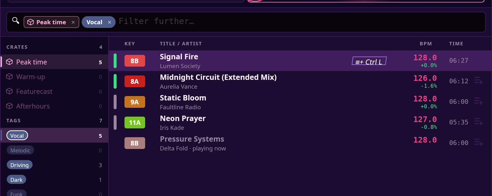
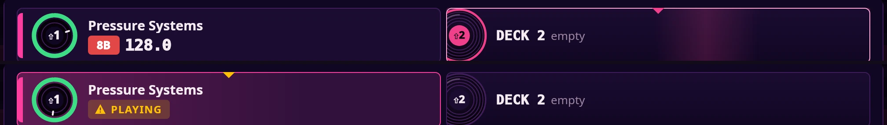
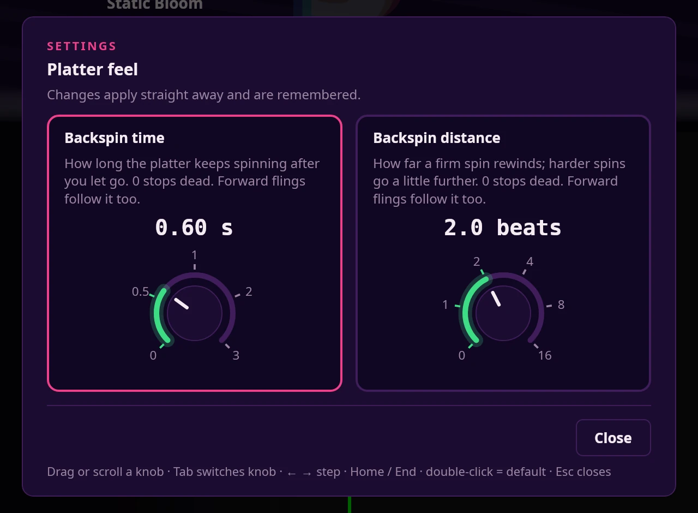

# What Sholto does

The full feature list. For what each part of the screen means, see
[the guide](README.md).

## Your library
- Finds every track in your music folder — **mp3, FLAC, WAV, AIFF, and M4A/AAC** — and reads the artist, title, and other tags automatically.
- Shows everything in a sortable list: **Artist · Track · BPM · Key · Time**.
- Analyses each track once and remembers the result, so it's instant every time after.

More: [library.md](library.md).

## Finding and organising
- **Search that fits your mix** — press the spacebar and type. Search ranks your tracks by how well they fit the deck you're *not* loading into: the header shows that deck's key, BPM and title. Each track is marked green (a good fit), amber (usable) or grey (a clash) from its key and tempo, with no bar until it is analysed, and half- and double-time count. Tracks you haven't loaded yet come first. With nothing loaded on the other deck (or its key and BPM not known yet), the list is simply A to Z by artist.
  - Type a few letters of a title or artist, or just the initials (`iltwykm` finds "I Like The Way You Kiss Me", `bsn` finds "Born Slippy .NUXX"). Add `bpm:128` (or `bpm:124-128`), `key:8a` or `#vocal` to narrow it down; every word you type has to match. Every rule is in [search.md](search.md).
  - Click the violet list mark on a row (**≡+**, or **≡✓** once it's in) to add that song to the Track List or remove it, or press **Ctrl + L**. A side list holds your crates and tags.
  - Search always covers your whole library. To narrow search itself, use a chip (below). It shows the best 250 matches.
- **Narrow search to a crate or tag** — click a crate or tag in the side list (or press **Enter** on it) and it becomes a chip in the search box; the list narrows to it, still ranked by fit. Chips stack (a crate *and* a tag), the side list marks the ones in use and shows how many tracks each would leave, and typed words filter on top. Click a chip's **×**, or press **Backspace** in an empty box, to take it off. Chips only narrow search; they don't filter the main list. If a re-rank takes a moment, the old list dims and a light runs down the fit bars; with reduced motion it just dims.

  

- **Load straight from search** — **Enter** loads onto the deck shown, **← / →** switches deck, and **Shift + 1** / **Shift + 2** load onto Deck 1 / Deck 2 directly.
- **The Track List** — the main view's list. **Ctrl + L** in search adds the highlighted song, crate or tag to it and leaves search open so you can add more. Loads add and never replace, and a song is never listed twice. The strip above the list shows what you've loaded; **×** removes the songs that source brought in. Drag the grip to reorder, press **Delete** to remove the highlighted song, or press **Ctrl + Del** twice in search to clear it. It is kept when you restart Sholto, and holds **All Tracks** on first launch.
- **See both decks while you search** — the two deck slots in the header each show a spinning platter (one turn per bar, stopped if your desktop asks for reduced motion) with a ring of the time left (red in the last 45 seconds), the title, key, BPM and time left. Click a slot to load the highlighted song onto it. The deck a load goes to is washed in its deck colour, with a notch on top; the platter reads **⇧1** / **⇧2**, the key that loads there; if it is playing the slot turns amber, and after the first press it turns red and reads "again to replace".

  
- **Asks before replacing a playing deck** — loading onto a deck that is playing shows a warning; load again within 3 seconds to confirm. This applies to the keyboard, the screen and the controller's LOAD buttons.
- **Undo a load** — **Ctrl + Z** within 10 seconds of a load puts the previous track back on that deck, paused at the spot where you replaced it. (EQ, filter and loop settings are not restored.)
- **Tags** — label any track with words that matter to you ("peak time", "vocal", "drum & bass"), then filter the whole library down to a tag in one click.
- **Crates** — group tracks into crates (like playlists or record boxes) and jump to a crate's contents instantly. An **All Tracks** crate always holds everything; **Ctrl + L** in search adds a crate's songs to the Track List.

## Reading your tracks
- **Automatic beat and tempo detection** — Sholto finds the BPM and marks the downbeats so your beatgrid lines up.
- **Key detection** — every track gets its musical key (with the Camelot code) so you can mix in harmony.
- **Stem separation** — splits a track into its parts (vocals, drums, bass, and the rest) so you can drop out the vocal or bring back the beat, live.
- A small progress bar shows a track being analysed, and a check mark when it's ready.

## Playing and mixing
- **Two decks** you can play, scrub, and mix independently.
- **3-band EQ** on each deck (highs, mids, lows) — cut a band all the way to silence, like a hardware isolator.
- **Filter knob** per deck — sweep from a low-pass to a high-pass for that classic build-up-and-drop feel.
- **Headphone cue** — pre-listen a track in your headphones while the crowd still hears the other deck.
- **Beat loops** — set a loop on the beat and halve or double its length on the fly.
- **Magnetic beat-snap** — when both decks are playing and the beats drift close together, the jog wheel gently "holds" on the beat and both waveforms glow green; let go and the deck locks to the other one's grid. No button to arm — it just happens. More: [deck.md](deck.md#magnetic-beat-snap).
- Pick which speakers or headphones Sholto plays to (it asks on first start, or **Settings ▸ Output device…**), and it remembers your choice.
- Sholto shows its icon in the system tray; click it to bring the window back.

More: [deck.md](deck.md).

## Seeing your tracks
- **Waveforms coloured by frequency** — deep bass, mids, and highs each get their own colour, and the height shows how intense each moment is, so you can spot the intro, the build-up, the drop, and the breakdown at a glance.
- **Two waveform styles**, chosen in **Settings ▸ Layout Wizard…**: **3-BAND** (the three bands drawn as layers) or **RGB** (Rekordbox-style fine stripes, each coloured by the mix of bass, mids and highs playing at that instant). See [waveforms.md](waveforms.md).
- **Beat-grid markers** along the top, with the downbeats highlighted.
- **A spinning vinyl disc** per deck that turns in time with the track, its ring shading from green to red as the track plays out and flashing near the end. Behind the BPM in the middle, soft bass, mid and high glows in your theme's waveform colours swell and fade with the music.
- **Stem chips** under each disc (drums / vocals / instrumental) — lit when you can hear that part, hollow when it's muted.
- The deck dims red when its volume is all the way down.
- **Eleven colour themes**, plus your own. The Layout Wizard's first step lets you try every theme on the whole app before you apply it; **Settings → Theme** switches straight away. See [themes.md](themes.md).

## Your DDJ-FLX4

Plug it in and it works. Click the controller icon in the top bar for a picture of
your DDJ-FLX4 with every knob, pad and button explained, including the Shift
combinations. Press anything on the real controller and the guide lights up the
matching control, without touching your decks. Controls Sholto doesn't use are
left uncoloured, so you can see at a glance what's live.

Close the guide (Esc, or its × button) and it shrinks into the controller icon, which pulses so you know where to reopen it; with your desktop's animations off it just fades.

**Browsing with the controller.** Turning the browse knob scrolls the Track List, and **LOAD 1** / **LOAD 2** loads the highlighted track (or the search pick while search is open). If the deck is playing, press **LOAD** a second time within 3 seconds to replace it. Hold the knob for about a second to re-analyse the highlighted track.

**Platter feel**, two knobs in **Settings ▸ Settings…**, sets how a fling on the jog wheel behaves
when you let go. **Backspin time** is how long the platter keeps spinning (0.6 seconds to start).
**Backspin distance** is how far a firm spin rewinds, counted in beats (2 to start, so it follows
the track's tempo); harder spins go a little further. Turn either to 0 and the platter stops dead.
Forward flings follow the same two knobs. Drag or scroll a knob (or use the arrow keys, Tab to switch
knob); double-click puts it back to its start value. Sholto remembers both.

Adding support for another controller is straightforward — Sholto keeps each
device's button layout in one place.

## Keyboard

- **Space** — open search (ranks tracks by fit against the deck you're not loading into; type to narrow, or search crates and tags).
- **Shift + 1 / Shift + 2** (in search) — load the highlighted track straight onto Deck 1 / Deck 2.
- **← / →** (in search) — choose which deck **Enter** loads onto.
- **Tab** (in search) — switch between the track list and the side list (crates, tags).
- **Enter** (in search, on a crate or tag) — add or remove it as a chip. **Ctrl + L** adds the highlighted song, crate or tag to the Track List. **Ctrl + Del** twice clears it. **Backspace** in an empty search box removes the newest chip.
- **Ctrl + Z** — undo the last load (within 10 seconds).
- **↑ / ↓** — move up and down the track list.
- **1 / 2** — load the highlighted track onto Deck 1 or Deck 2.
- **Enter** — open the actions menu for the highlighted track (add it to a crate, or tag it).
- **P** — play / pause Deck 1; hold **Shift** for Deck 2.
- **G** — open the beatgrid / tempo tuner on the playing deck; then **↑ / ↓** change the tempo and **← / →** nudge the grid.
- **M** — drop a marker on the playing deck.
- **Esc** — close the tuner.
- **F11** — toggle fullscreen.

The full table, with the Shift variants, is in [the guide](README.md#keyboard-at-a-glance).
