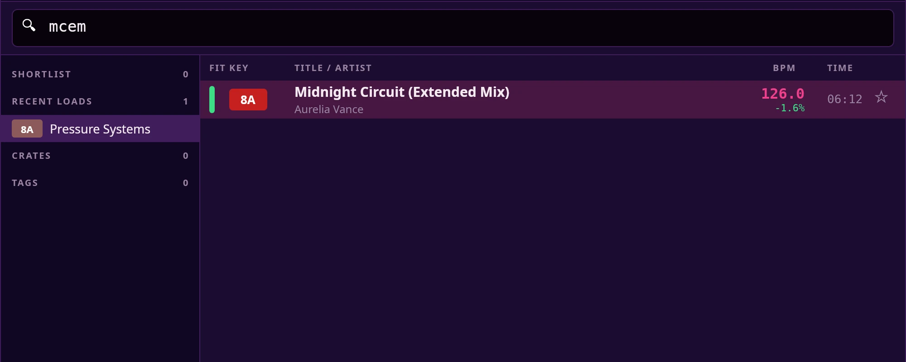
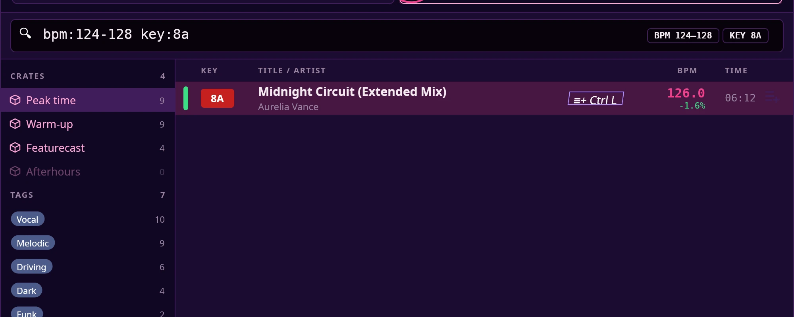

# Search

Press **Space** (or give the browse knob a short press) and start typing. Search
looks through your whole library and puts the tracks that fit your mix at the
top.

## What to type

| You type | It finds |
|---|---|
| `kiss me` | Tracks with "kiss me" in the artist, the title or a tag |
| `iltwykm` | **I Like The Way You Kiss Me** — the first letter of each word in the title |
| `ailtwykm` | The same track, with the artist's initial first (**A**rtemas) |
| `artemas kiss` | Tracks that match *both* words |
| `bpm:128` | Tracks at 128 BPM (127.5 to 128.5) |
| `bpm:124-128` | Tracks from 124 to 128 BPM |
| `key:8A` | Tracks in 8A, and only 8A |
| `#vocal` (Tab completes) | Tracks with a tag that contains "vocal" |
| `#vocal bpm:120-125 key:8a` | All three at once |

Capitals never matter. Every word you type has to match, so each extra word
narrows the list.

When Sholto understands a `bpm:`, `key:` or `#` word, it shows it as a small
label beside the box (**BPM 128**, **KEY 8A**, **#vocal**). No label means it was
read as ordinary text.

## Names

Type part of an artist, a title or a tag. `slip` finds "Born Slippy .NUXX".

- It looks for the letters exactly as you type them, anywhere in the name.
  Typos don't match.
- Accents and punctuation are ignored: `beyonce` finds "Beyoncé", and
  `hip-hop` finds "Hip-Hop". Only the letters a-z and the digits 0-9 count.
- Album, genre and file name are not searched.

## Initials

Type the first letter of each word, with no spaces. Use at least two letters.

| Track | Initials |
|---|---|
| Artemas — I Like The Way You Kiss Me | `iltwykm` |
| Underworld — Born Slippy .NUXX | `bsn` |
| Daft Punk — One More Time | `omt`, or `dpomt` with the artist |
| Queen — Don't Stop Me Now | `dsmn` (see below) |
| Calvin Harris — This Is What You Came For (feat. Rihanna) | `tiwycf` |

How Sholto works out the initials:

- Words are split on spaces only. Everything inside a word that isn't a plain
  letter or digit is dropped, so "Don't" is one word and gives `d`. That's why
  "Don't Stop Me Now" is `dsmn`. The same goes for "AC/DC" (`a`) and "Hip-Hop"
  (`h`).
- Accents are folded to their plain letters first (é, ö and ñ become e, o and
  n; ø, æ, œ, ß, ł and đ become o, ae, oe, ss, l and d): "Röyksopp" gives `r`.
- A word left with nothing after that, such as a lone "-" in "Fred again.. -
  Delilah", is skipped.
- Nothing is skipped. "feat." is a word like any other, so "(feat. Rihanna)"
  adds `fr` to the end.
- You don't have to start at the beginning. The artist's initials and the
  title's initials are joined into one run (`a` + `iltwykm`), and your letters
  can match any part of it: `iltw`, `ltwykm` and `ailtwykm` all find the Artemas
  track.
- A short run like `dp` can turn up more than you expect. Add letters to
  narrow it.

A word that matches as ordinary text matches anyway, so you never lose a
result by typing a real word.

## BPM

- `bpm:128` finds tracks within half a beat per minute of 128.
- `bpm:124-128` finds 124 to 128, both ends included. The order doesn't matter.
- Use whole numbers. `bpm:128.5` is read as ordinary text and finds nothing.
- Don't put a space after the colon.
- It uses the BPM you see in the list, including any ½ / ×2 correction you made.
  It does not also look at half or double tempo: `bpm:128` won't find a track
  shown as 64.
- Tracks with no BPM yet are left out.
- One BPM filter at a time. If you type two, the last one counts.

## Key

- `key:8A` finds tracks in 8A only. Use the Camelot code, `1A` to `12B`.
- Neighbouring keys are not included. To find tracks that mix with what's
  playing, leave the key out and let the [ranking](#how-the-list-is-ordered) do
  it.
- Musical key names such as `key:Am` aren't understood. They are read as
  ordinary text and find nothing.
- Tracks with no key yet are left out.
- One key at a time. If you type two, the last one counts.

## Tags

- `#gar` finds a track tagged "uk garage": part of the tag name is enough.
- Type several to need them all: `#vocal #house` finds tracks that have both.
- Plain words search tags too, so `vocal` without the `#` also works. The `#`
  just makes sure the match is on a tag and not a title.
- Type `#drum` and the rest of a matching tag appears faintly; press **Tab** to
  turn it into that tag's chip.
- Completion only continues the start of a tag name, and stops at a space. It
  skips tags that are already chips, prefers tags you used recently, and keeps
  the plain words you typed.

## The side list

The column beside the results has four groups:

- **Shortlist** — tracks you've marked to play soon. Press **Q** (with the box
  empty) or click the ☆ on a row to add or remove one. Sholto remembers your
  shortlist when you restart.
- **Recent loads** — the last six tracks you loaded this session.
- **Crates** — your crates. Typing narrows them to names containing your text.
- **Tags** — with the box empty, tags you've picked this session first, then
  your most used, up to ten. Typing shows up to ten tags that start with, then
  contain, your text.

Only plain words narrow the crates and tags. `bpm:`, `key:` and `#` words don't.

## Narrowing to a crate or tag

Click a crate or tag in the side list, or press **Enter** on it, and it becomes
a chip in the search box. The results narrow to it. Do it again to take the
chip off.

- Chips stack, and every chip must match. Two crates leave the tracks that are
  in both. A crate and a tag leave the tracks in that crate with that tag.
- A tag chip is that exact tag. `#vocal` typed in the box is looser: any tag
  containing "vocal".
- Adding a chip clears the plain words you typed (they were finding the crate).
  Any `bpm:`, `key:` and `#` words stay.
- Words you type after that filter within the chips. The box reads
  **Filter further…** while a chip is on.
- Each crate and tag in the side list shows how many tracks it would leave with
  the chips you have. Ones that would leave none are dimmed.
- Take a chip off with its **×**, or press **Backspace** in an empty box to remove
  the newest one.
- **Ctrl + Enter** on a crate or tag does something else: it filters the main
  library to it and closes search.

Search always covers your whole library. Filtering the main library list to a
crate or tag does not narrow search; chips do.

When nothing is left, the list says why: "No tracks in Peak time tagged Vocal",
or "No “bsn” in Peak time". With no chips it reads "Nothing matches …" and
reminds you that initials work.

## How the list is ordered

Search measures every track against the deck you are **not** loading into —
the deck that has **FIT** in its slot at the top. Its key, BPM and title show
in the header.

**When that deck has a track with a known key and BPM**, each result gets a
coloured bar:

- **Green** — a good fit: a close key and a close tempo.
- **Amber** — usable, with care.
- **Grey** — a clash. Tempos more than 6 % apart are always grey.
- **No bar** — the track is still being analysed, or has no key or BPM yet.

Half and double tempo count as a match, so a 64 BPM track can fit a 128 BPM
deck. Beside each BPM, the difference from that deck shows as a percentage.

The order favours, in turn:

1. Tracks you haven't loaded this session. Ones you have, and the track on the
   reference deck itself, drop to the bottom and are dimmed.
2. Green, then amber, then grey, then no bar.
3. Within a colour, the better key and tempo match.
4. Then the smaller tempo difference.

**When that deck is empty, or its key or BPM isn't known yet**, there are no
bars and the list is A to Z by artist, then by title.

How a word matched — by name or by initials — makes no difference to the order.

## How many results

Search shows at most **250** tracks, best first. The footer reads, for example,
**250 of 1,234**: 250 shown, out of the 1,234 tracks searched (the whole library,
or what your chips leave). If what you want isn't there, type more to narrow it.
With no deck to fit against, the list is alphabetical, so this matters most for
artists late in the alphabet.

## Loading

When search opens, it picks the deck to load onto: an empty deck first (Deck 1,
then Deck 2); otherwise the deck that isn't playing; if both play, the one with
less time left. The box keeps your last search, selected, so typing replaces it. Chips stay on
until you take them off.

Loading closes search. Loading onto a playing deck needs a second press within
3 seconds. **Ctrl + Z** within 10 seconds puts the previous track back, paused
where it was.

## Keys

| Key | What it does |
|---|---|
| **↑ / ↓** | Move one row |
| **Page Up / Page Down** | Move eight rows |
| **Tab** | Switch between the results and the side list, or accept a faint tag completion |
| **← / →** | Switch which deck **Enter** loads onto |
| **Enter** | On a track: load it. On a crate or tag: add or remove its chip |
| **Ctrl + Enter** | On a crate or tag: filter the main library to it and close search |
| **Shift + 1** / **Shift + 2** | Load the highlighted track straight onto Deck 1 / Deck 2 |
| **Q** | Add or remove the highlighted track from your shortlist (empty box only; otherwise it types a q) |
| **Backspace** | In an empty box: remove the newest chip |
| **Ctrl + Z** | Undo the last load, within 10 seconds |
| **Esc** | Close search |

**Mouse:** click a row to highlight it, double-click to load it. Click the ☆ to
shortlist. Click a crate or tag to add or remove its chip. Click a LOAD TO slot
to choose the deck. Click the dark backdrop to close.

**Controller:** a short press of the browse knob opens search; press again to
switch between the results and the side list. Turn the knob to move.
**LOAD 1** / **LOAD 2** loads the highlighted track.
