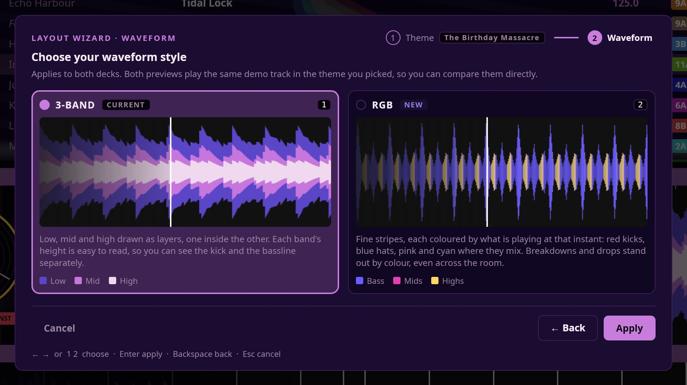

# Waveform styles

Each deck's waveform can be drawn two ways. Both show the same track, the same
beatgrid, loops, markers and vocal lane; only the drawing of the music changes.

| Style | What you see |
|---|---|
| **3-BAND** | Bass, mids and highs drawn as three layers, one inside the other. Each band's height is easy to read on its own, so you can see the kick and the bassline separately. |
| **RGB** | One silhouette made of fine stripes, one per moment of the track. Each stripe is coloured by the mix of bass, mids and highs playing at that instant, and its height is how loud that instant is. Breakdowns and drops stand out by colour. |

In both, height is loudness, so a quiet intro reads short and the drop reads tall.
The colours come from your theme — every theme has its own 3-BAND and RGB colours
(see [themes.md](themes.md)).

## Choosing one

**Settings ▸ Layout Wizard…**, then **Next** to the waveform step.

Both previews play the same demo track in the theme you picked, so you can compare
them directly. Picking a card changes both decks straight away.

| Key | What it does |
|---|---|
| **← / →** or **1 / 2** | Pick 3-BAND or RGB |
| **Enter** | Apply — keeps the theme and the waveform style |
| **Backspace** | Back to the theme step |
| **Esc** | Cancel — puts back the theme and style you had |

Sholto remembers your choice.
